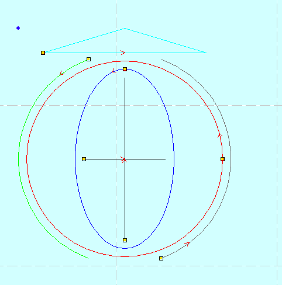
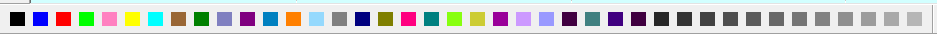

# ezdxf-lasercut53

[Ezdxf](https://pypi.org/project/ezdxf/)
is a Python library for generating dxf-format CAD files
[wikipedia:AutoCAD_DXF](https://en.wikipedia.org/wiki/AutoCAD_DXF).

LaserCut53 can import DXF files and drive a
[Rabbit CO2 laser cutter](https://rabbitlaserusa.com/).

The dxf file format has gone through many revisions, so not all
of them can be read properly by LaserCut53. This project is just
an example of the proper incantations to cause ezdxf to create
a file that will import correctly into LaserCut53. It's the result
of a lot of trial and error and experimenting. It works for me, maybe
it will work for you also.

Development and testing was done on Debian Bullseye with the
version of ezdxf supplied by debian (`apt-get install python3-ezdxf`).
That's version 0.14 of ezdxf, which is slightly behind the latest on
the ezdxf project page.

The demo just creates some basic shapes (circle, line, ellipse, arc).

Different colors are assigned to different shapes to that the
LaserCut53 menu

![the color buttons available on the LaserCut53 screen]cutmenu.png
Can assign different laser settings (cut speed and laser power) to
different objects. 
